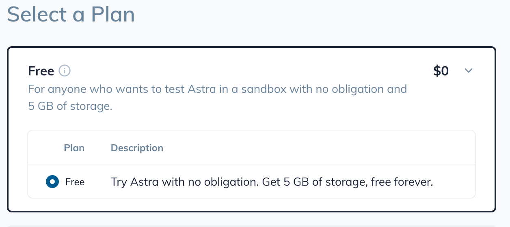
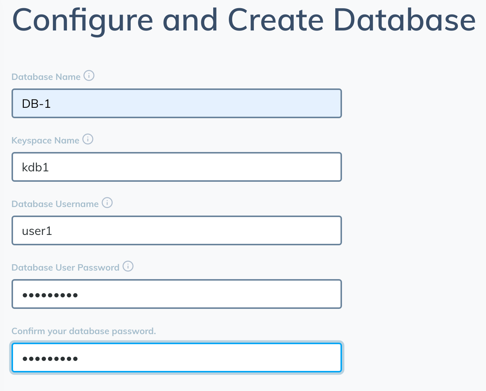
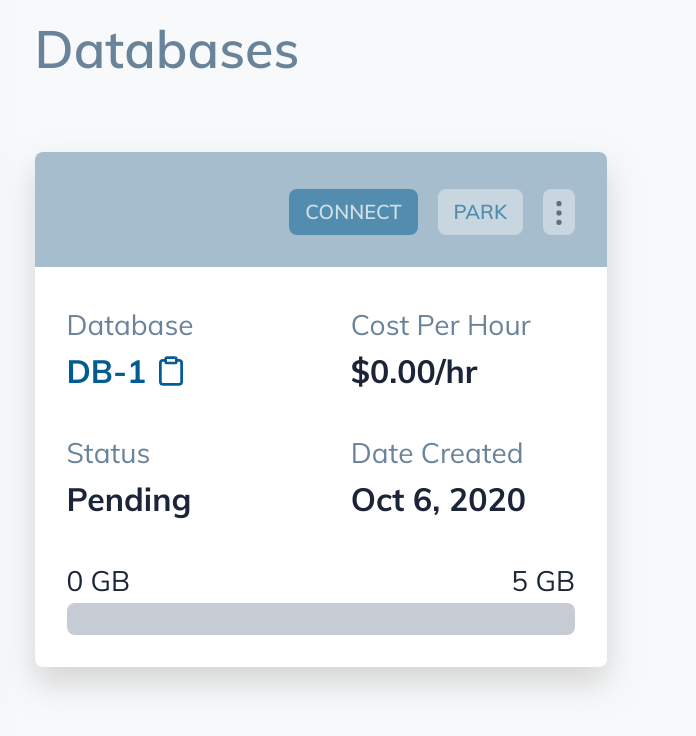
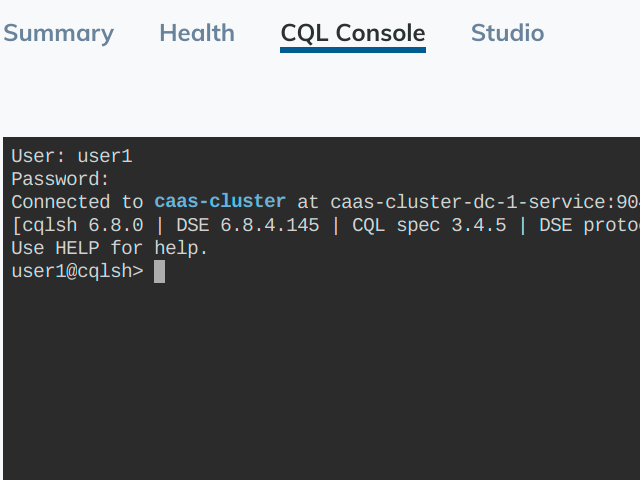
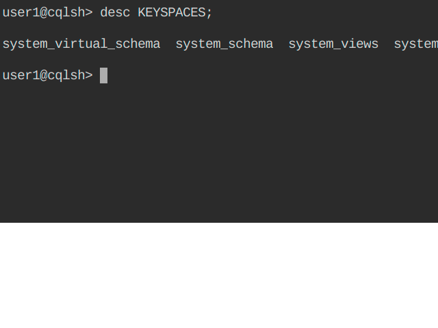

# Aprende lo Basico de Cassandra DB en ASTRA

Este pequeño proyecto enseña lo básico de Cassandra DB en la nube de ASTRA.

## Comenzando 🚀

Lo primero que debemos tener en cuenta es: que es ASTRA ??

Al igual que otras nubes publicas, ASTRA se constituye como una nube especialmente diseñada para Cassandra DB, la cual tiene varios planes de acuerdo a nuestras necesidades.

Para efecto de este ejercicio, utilizaremos el servicio de Cassandra sobre ASTRA de DataStax que nos ofrece de forma gratuita. Esta Base de Datos solo tiene 5 GB de capacidad y _tendrá algunas funcionalidades limitadas_


### Pre-requisitos 📋

_Como iniciar a Trabajar en la nube de ASTRA ?_


Deberemos seguir estos pasos para darnos de alta:

1. Lo primero que debemos hacer es registrarnos en la pagina https://astra.DataStax.com

2. Una vez dentro, tenemos varias opciones para poder darnos de alta:

Podemos utilizar el metodo de autenticacion de nuestra preferencia, bien sea creando una cuenta en ASTRA o utilizando un usuario de GitHub creado previamente o la autenticación integrada de Google.

3. ASTRA nos invita a utilizar la herramienta, y una de las cosas que hace por nosotros es darnos una suscripción gratuita de hasta 5GB; para esta demo es mas que perfecta. Así que seleccionemos la primera opción.




4. Una vez seleccionada el plan, procederemos a crear la DB, diligenciando el formulario que nos entrega ASTRA y haga click en el botón Crear



5. Una vez puesto el proceso de creación de la DB, este tomara algunos minutos y posteriormente aparecerá la DB como aparece a continuación:



En este paso solo nos restara conectarnos a nuestra base de datos con los datos de usuario y contraseña creados con anterioridad en el formulario de creacion de la DB.

### Ejercicios Prácticos 📋

Al igual que en una DB del tipo SQL, podemos hacer consultas y demás utilizando un lenguaje que para este caso sera CQL (Contextual Query Language).

Iniciemos entonces con el proceso de conexión a la DB recien creada. Para ello, haremos click en el botón Connect sobre la Base de Datos y posteriormente seleccionaremos el marcador _CQL CONSOLE_ en color azul y haremos click en el botón azul Connect.

Una vez hecho esto, la consola se activara y pedira usuario y contraseña: aqui los datos que se deben ingresar son los que se crearon en el formulario de la DB hecho en el paso 4.



Aqui ya podremos correr nuestro primer comando. Miremos que keyspaces tenemos creados:

```
user1@cqlshuse> desc KEYSPACES;
```

Este comando nos monstrará los keyspaces que tiene creada la DB en este momento. Uno de ellos será el que creamos durante el proceso de creación de la DB.



Utilizaremos nuestro keyspace creado anteriormente (kdb1), y para ello utilizaremos el siguiente comando:

```
user1@cqlshuse> keyspace kdb1;
```
El comando, modificara el prompt y mostrar que ahora estamos ubicados dentro del keyspace:

```
user1@cqlshuse:kdb1> 
```


### Instalación 🔧

_Una serie de ejemplos paso a paso que te dice lo que debes ejecutar para tener un entorno de desarrollo ejecutandose_
