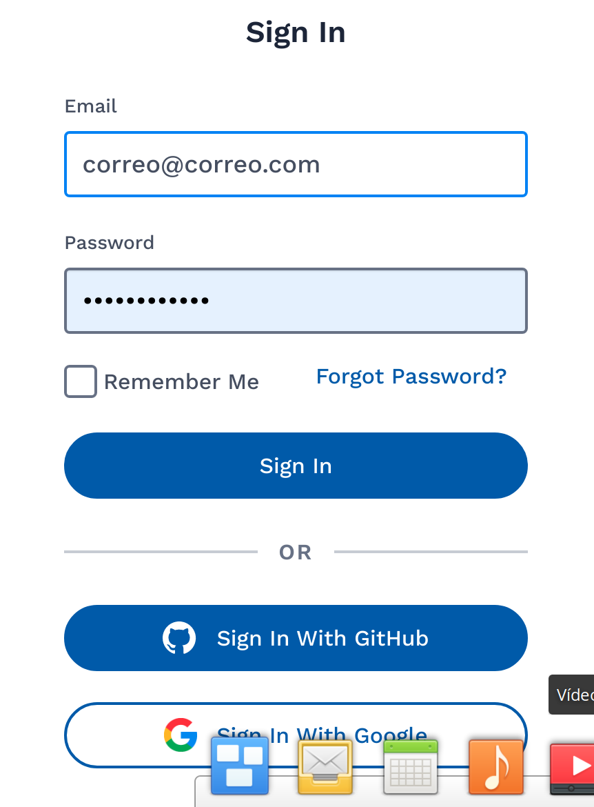

# Aprende lo Basico de Cassandra DB en ASTRA

Este pequeño proyecto enseña lo básico de Cassandra DB en la nube de ASTRA.

## Comenzando 🚀

Lo primero que debemos tener en cuenta es: que es ASTRA ??

Al igual que otras nubes publicas, ASTRA se constituye como una nube especialmente diseñada para Cassandra DB, la cual tiene varios planes de acuerdo a nuestras necesidades.

Para efecto de este ejercicio, utilizaremos el servicio de Cassandra sobre ASTRA de DataStax que nos ofrece de forma gratuita. Esta Base de Datos solo tiene 5 GB de capacidad y _tendrá algunas funcionalidades limitadas_


### Pre-requisitos 📋

_Como iniciar a Trabajar en la nube de ASTRA ?_


Deberemos seguir estos pasos para darnos de alta:

1. Lo primero que debemos hacer es registrarnos en la pagina https://astra.DataStax.com

2. Una vez dentro, tenemos varias opciones para poder darnos de alta:



Podemos utilizar el metodo de autenticacion de nuestra preferencia, bien sea creando una cuenta en ASTRA o utilizando un usuario de GitHub creado previamente o la autenticación integrada de Google.

3. ASTRA nos invita a utilizar la herramienta, y una de las cosas que hace por nosotros es darnos una suscripción gratuita de hasta 5GB; para esta demo es mas que perfecta. Así que seleccionemos la primera opción.


4.

```
Da un ejemplo
```

### Instalación 🔧

_Una serie de ejemplos paso a paso que te dice lo que debes ejecutar para tener un entorno de desarrollo ejecutandose_
